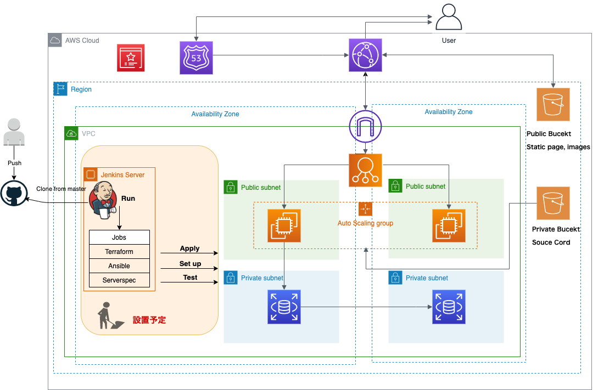

# アプリケーションインフラのTerraform によるコード化
## 構成図

# 特徴
- マルチAZによる冗長化
- ALBによる負荷分散
- オートスケーリングによる可用性向上
- CloudFrontの活用による静的コンテンツの高速配信
- HTTPS通信にセキュリティの確保

# Jenkinsによる自動化(設置予定)
- Terraformによるリソースの生成
- Ansibleによるサーバ設定
- Serverspecによるテスト